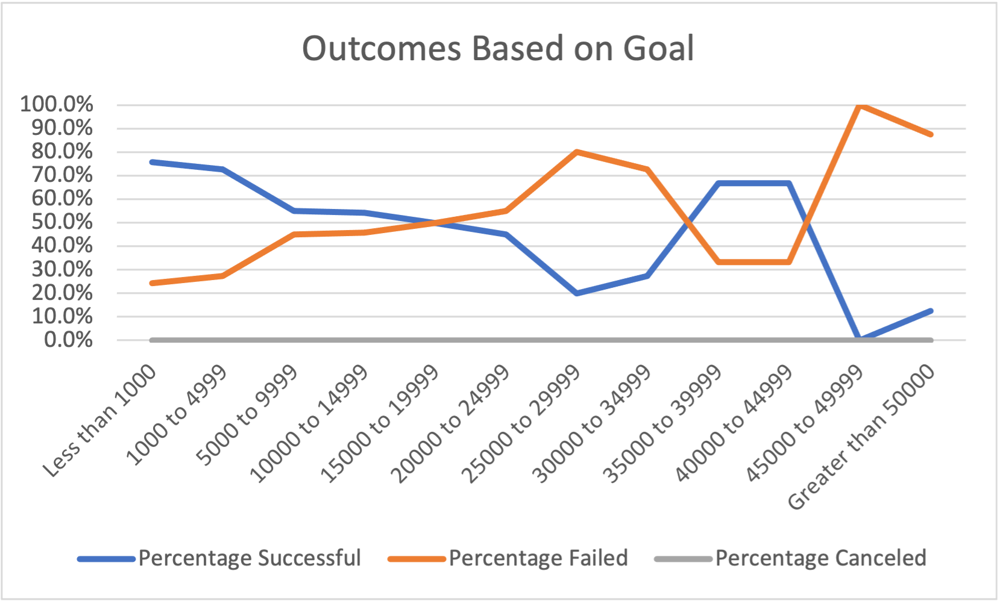

# Kickstarter Analysis
## Overview of Project 
An analysis was conducted on Kickstarter data to determine a successful fundraising strategy for a theater play based on historical campaigns' launch date, fundraising goal, and amount pledged.   After the analysis, the client launched her fundraising campaign which had an unsuccessful outcome.  As a result, this analysis seeks to understand how theater plays' fundraising campaign outcome relates to its launch date and funding goal.
## Analysis and Challenges
The initial step in the analysis was to gain familiarity with the dataset and then to format and manipulate the data to aid in the analysis. The deadline and launch date data were converted from unix time to standard time.  Additional columns were created to parse the parent category from the subcategory for a given fundraising campaign which allowed for an aggregated analysis of the campaigns across different types of projects. The use of pivot tables allowed key data to be extracted and compared in an easy manner.  

Specifically, for the first part of the analysis, the parent category was selected on Theater projects and these project's launch date (displayed in months) and outcomes (successful, failed, or canceled) were compared as seen in the chart below.

For the second part of the analysis, the Goal data was parsed to divide the monetary funding goals for each project into a given category (refer to the x-axis of the chart for the categories).  Next the percentage of successful, failed, and canceled outcomes were calculated for projects with a parent category of Theater and subcategory of Plays.  The outcome is a chart visualizing the relationship between the theater play projects' outcomes and monetary goal categories.

The last stage of the analysis was drawing conclusions based on the relationships depicted in the charts.  

In addition, this analysis could pose a couple of challenges: One challenge could be understanding how to convert the deadline and launch dates from unix to standard time. A second challenge could be properly using the pivot table and chart functions in Excel to ensure data is displaying correctly for easy visual analysis. 

## Results
Based on the Theater Outcomes by Launch Date chart, while cancelled campaigns remain relatively low and constant, failed and successful campaings tend to move in the same direction with the same peaks and troughs, though, with varying degrees.  Throughout the year there are more successful camapigns than failed, and the spring (April, May, and June) are the best months to launch a successful campaign. December is the worst with the number of failed and successful campaigns converging.

From analyzing the Outcomes Based on Goals chart, the percentage failed and percentage successful appear as mirror images of each other and are inversely related based on the monetary funding goal. Thus, as the percentage of successful campaigns goes up, the percentage of failed campaigns goes down and vice versa. 

A limitation of the dataset is the sample of the theater plays as it may not be a representative sample of the population and therefore may lead to erroneous conclusions.  Another limitation is that the data in the dataset may not explain projects' campaign outcomes with statistical significance and therefore additional project characteristics should be considered.  These other characteristics could be qualitative and include level's of fundraising experience, connections to donors, and marketing of the campaign. They could also be quantiative such as economic data for a given year to provide insight into the financial health of the economy and whether that affected the campaign outcome.    

Despite having gained insight into how theater plays' fundraising campaign outcomes relate to the campaigns' launch dates and funding goals, there is room for further analysis.  This includes analyzing other characteristics of the theater plays in the dataset to determine if there are other relationships that led to a given outcome. A chart depicting the average donation or the number of donors compared to the campaign outcome would inform what type of donors should be targeted in the campaign.  For example, if successful campaigns have a high average donation in comparison to failed campaigns, this suggests targeting a smaller group of wealthier donors would be more effective compared to targeting a large group of donors who do not have as much disposable income. 

An additional chart to create is one depicting the length of the fundraising campaign comapred to the outcome as the length of time a campaign is open may be an indication of its success. 

