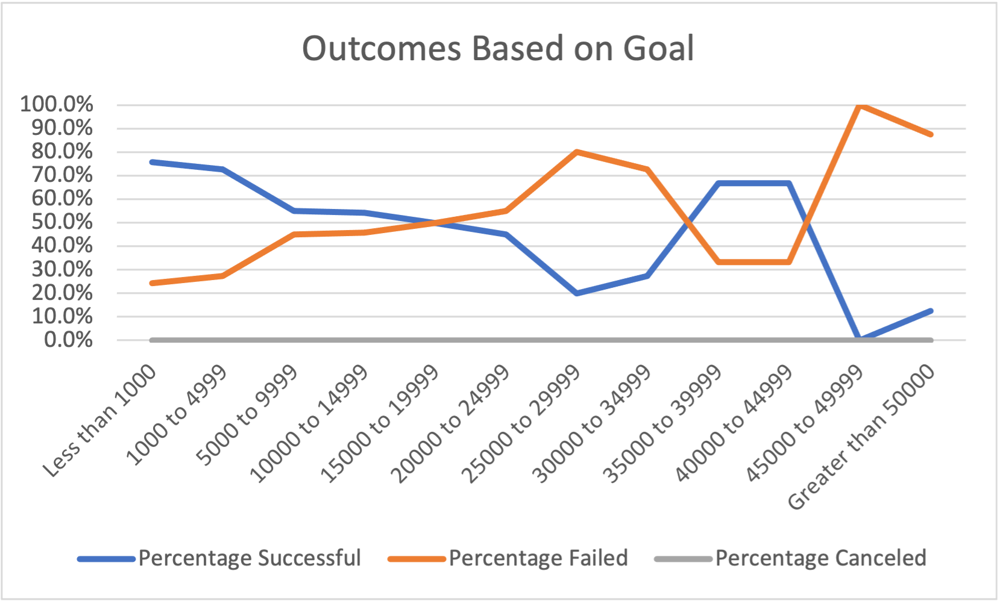

# Kickstarter Analysis
## Overview of Project 
An analysis was conducted on Kickstarter data to determine a successful fundraising strategy for a theater play based on historical campaigns' launch date, fundraising goal, and amount pledged.   After the analysis, the client launched her fundraising campaign which had an unsuccessful outcome.  As a result, this analysis seeks to understand how theater plays'fundraising campaign outcome relates to its launch date and funding goal.
## Analysis and Challenges
The initial step in the analysis was to gain familiarity with the dataset and then to format and manipulate the data to aid in the analysis. The deadline and launch date data was converted from unix time to standard time.  Additional columns were created to parse the parent category from the subcategory for a given fundraising campaign which allowed for an aggregated analysis of the campaigns across different types of projects. The use of pivot tables allowed key data to be extracted and compared in an easy to read manner.  

Specifically, for the first part of the analysis, the parent category was selected on Theater projects and these project's launch date (displayed in months) and outcomes (successful, failed, or canceled) were compared as seen in the chart below.

For the second part of the analysis, the Goal data was parsed to divide the monetary goals for each project into a specific category  (refer to the x-axis of the chart for specific categories).  Next the percentage of successful, failed, and canceled outcomes were calculated for projects that were Theater Plays.  The outcome is a chart visualizing the relationship between the theater play projects' outcome and monetary goal.

